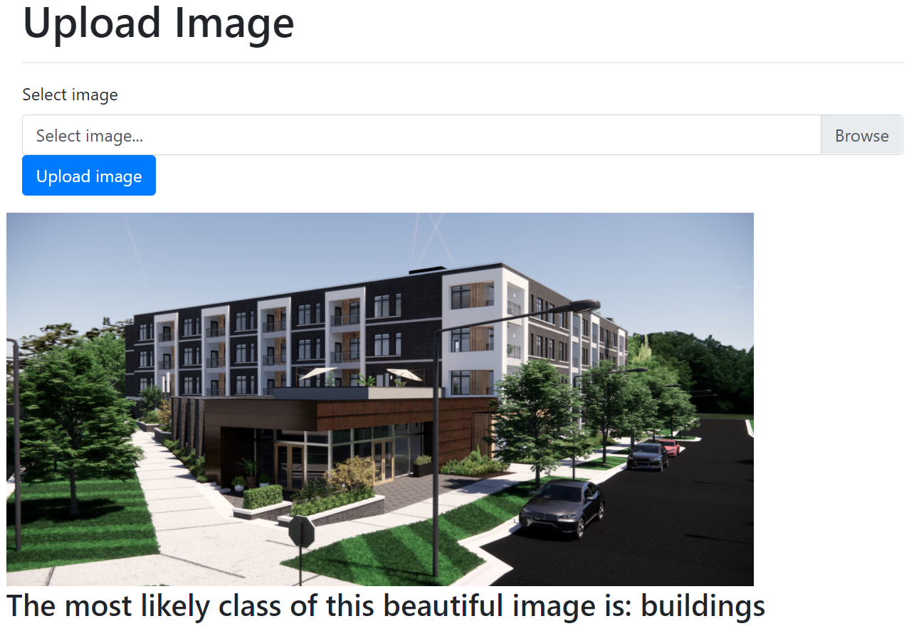

# Deep Learning Neural Network Image Classifier

This repository hosts a deep neural network machine learning model, which can be used to classify images which fall into six classes of buildings, forest, glacier, sea, mountain, and street.

I use Flask to build the app UI. I use a pretrained VGG16 Convolutional Neural Network (https://neurohive.io/en/popular-networks/vgg16/) to classify the images. On the validation data, the model had a ~89% classification accuracy and there was less overfitting which makes me believe it's a decent model to start with.

One thing I failed on was deploying the app on Heroku. I kept getting "Error R14 (Memory quota exceeded)" error messages after the app was deployed. I could not get past beyond that point. I'll be curious to know how folks get around such issues on Heroku.

When you run the flask app on your machine, you should get a UI which looks like below. The UI allows you to upload an image and it will perform the classification for you. Just make sure that you upload images from your static/my_test folder but you can modify this path if you want to inside image-cl-flask.py.

